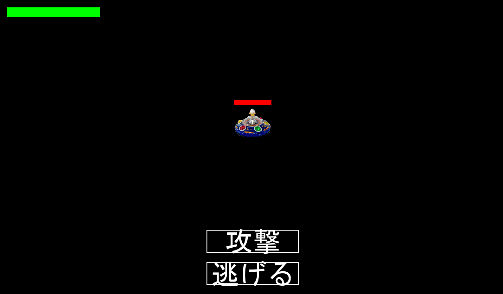

# KOKATONTALE

## 実行環境の必要条件
* python >= 3.10
* pygame >= 2.1

## ゲームの概要
* 自身が攻撃するとその後敵が攻撃し、その攻撃をプレイヤーが操作しよける。RPGのようなゲーム
* 敵の攻撃は主にパターンあり、赤い丸を避けるゲームとビームを避けるゲームの2パターンあります。

## ゲームの遊び方
* エンターキーでゲームが開始
* 敵が現れて攻撃か逃げるを選択
* 逃げるを選択するとゲームが終了します。
* 攻撃を押すと敵にダメージが入り敵の攻撃が始まる。
* 矢印キーキーを用いてこうかとんを操作し敵の攻撃を15秒間よける。
* こうかとんのHPが0になったら画面に「留年確定」と表示させゲームオーバーとなります。
* 敵のHPがゼロになると「卒業おめでとう」と表示されてゲームが終了します。

## ゲームの実装
### 共通基本機能
* 背景画像と主人公キャラクター、敵キャラ、を描画

### 分担追加機能
* 敵の攻撃:庄山、栗原

* 無敵判定:白葉

* ゲームのコマンド選択画面:佐藤

* スタート画面：仲田

*  

### ToDo
- [ ] プログラムの骨組みの作成
- [ ] 関数名の統一

### メモ

